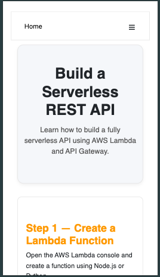
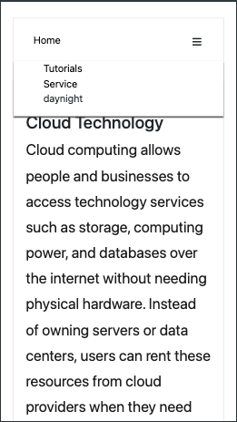
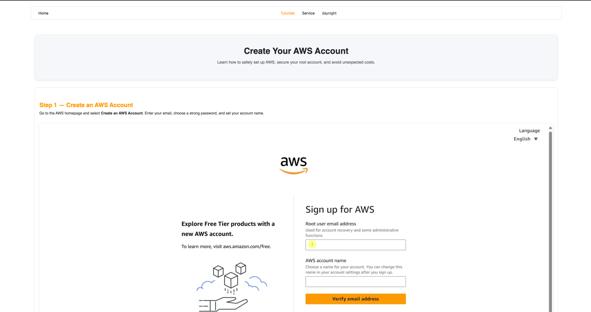
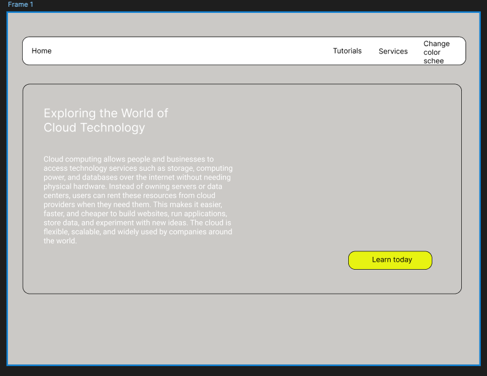
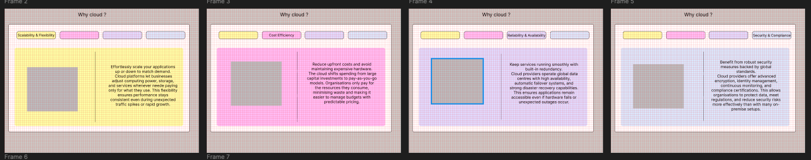
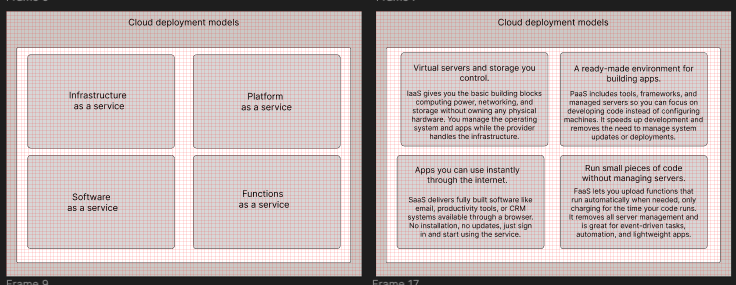
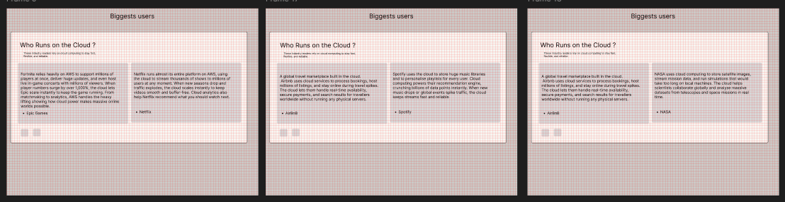
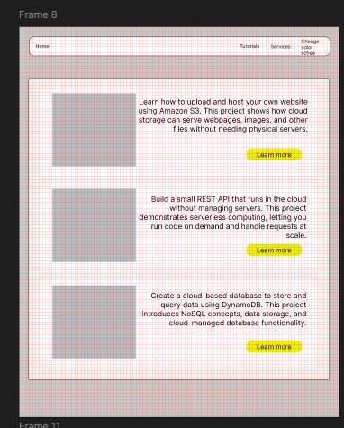
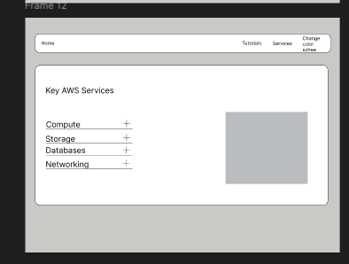

# TeachingCloud

An informational page introducing cloud to beginners looking to learn.

- [Here](https://shaqkori.github.io/teachingCloud/) is a live preview of the website

## Table of Contents

- [Project Goals](#project-goals)
- [Features and Benefits](#features-and-benefits)
- [Deployment](#deployment)
- [Responsivity](#responsivity)
- [Validation and Performance testing](#validation-and-performance-testing)
- [Bugs and Errors](#bugs-and-errors)
- [Images](#images)
- [Decleration of AI](#decleration-of-ai)
- [Colour Pallete](#colour-pallete)
- [Wire frames](#wire-frames)
- [UX / UI](#ui--ux)
- [Updates](#updates)

## Project Goals

- Provide a platform for the inexperienced to learn and understand cloud computing and how it use utilised across different sectors.
- Inform about the fundamental benefits to cloud computing over traditional hosting.
- Showcase AWS the leading cloud provider and the services they offer and how major companies benefit from them.
- Provide step by step tutorials for users to set up and use services within the cloud to immerse themselves in cloud technology and gain experience.
-

## Features and Benefits

- **Accessible UI**
- **AWS Tutorials**
- **Hands on Learning**
- **Modern Tech Stack**
- **Helps beginners learn through simplified explanations**

## Deployment

- This website is deployed and hosted through GitHub Pages.
- Changes and modifications all happen through Github and are deployed through GitHub actions.

## Responsivity

### Mobile First Design

This website was designed with mobile users in mind first, ensuring the all elements can shrink to fit the smallest screens without the overall structure of the page being broken. This is to ensure that the website can be accessible to any user on any device.

To achieve this, the design relies heavily on persentage-based widths and rem sizing, which fits the structure of the mobile view whilst also being able to expand to larger view ports with out the need to specifically define within a meadia query. However, meadia queries where used for elements such as the hamburger in the Nav burger so that when the screen size hits a certain length it no longer displays and instead the nav elements switch to display flex with space between instead of being stacked.

Adaptive images are used so the images resize automatically with rules such as max-width: 100%. which allows an image to grow to the width of the conainter without affecting the structure of the webpage.

### Larger Screens

For larger screens simple meadia queries where used to modify the page layout such that everything is not cramped to just accomodate mobile views. Such as the the nav element with the nav items. Also display: grid is utilised fo the flip card elements to create a 2 by 2 grid on a larger screen and ensures the elements keep shape and fit the container so the content is readable.

## Validation and Performance testing

See [Here](./validation.md) for Performance testing and validation results

### Screen shots - Mobile

### Screen shots - Desktop

## Bugs and Errors

A recurring error in validation was putting an anchor tag as a decendant of the button class. To resolve this i used javascripts 'onclick="window.location.href=' to map to the defined page.

## Images

The Stock images from the website where taken from [pixabay](https://pixabay.com/). For the images for the tutorial they were screenshots taken by my self of the AWS console.

## Reference

For the flip card elemen [this](https://www.youtube.com/watch?v=OV8MVmtgmoY) tutorial was followed to achieve the result.

## Decleration of AI

The use of AI was featured in the project for the genration of the text content which allows me to focus on just creating and styling the website itself. Also AI played a role in assiting in styling seen in the accordian section on the services page.

## Colour Pallete

The color scheme for the website follows AWS main page colours with the white backgrounds and the solid orange for the buttons.

## Wire frames

Mock up designs where created to structure the development of the page using figma. Whilst some designs where not final it served as a baseline of how the website was intended to look.

## UI / UX

This design follows the key standards

The design of this website focuses heavily on clarity, simplicity, and accessibility to ensure beginners can navigate and learn cloud concepts without confusion. The user interface is intentionally minimalistic, using clean layouts, high-contrast colours, and consistent spacing to reduce cognitive load. Each section is structured logically so users can follow tutorials step-by-step without feeling overwhelmed.

From a UX perspective, the site uses predictable navigation patterns, clear visual hierarchy, and mobile-friendly layouts to ensure users can interact with the content on any device. Buttons, cards, and icons follow a consistent style and affordance, helping users understand where to click and what actions they can take. Tutorials are broken into digestible sections, supported by visuals and code examples to guide learners smoothly through each task.

The overall goal is to provide a friendly and intuitive learning experience, one where users don't have to figure out how the website works so they can instead focus on learning cloud technology efficiently.
