# Table of Contents

- [CSS Validation](#css-validation)
- [HTML Validation](#html-validation)
  - [Home Page](#home)
  - [Tutorials Page](#tutorials-page)
  - [Services Page](#services-page)
  - [Create Account Page](#create-account-tutorial)
  - [S3 Tutorial Page]()
  - [Lambda Tutorial Page]()
  - [DynamoDB Tutorial Page]()
- [Performance Validation]()
  - [Home Page]()
  - [Tutorials Page]()
  - [Services Page]()
  - [Create Account Page]()
  - [S3 Tutorial Page]()
  - [Lambda Tutorial Page]()
  - [DynamoDB Tutorial Page]()

## CSS Validation

The validation for the css returned no errors and a few error which can be ignored.
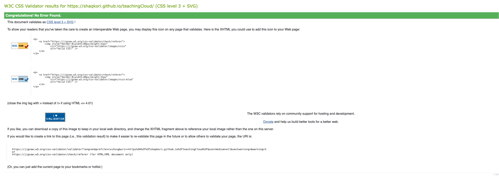

## HTML Validation

### Home

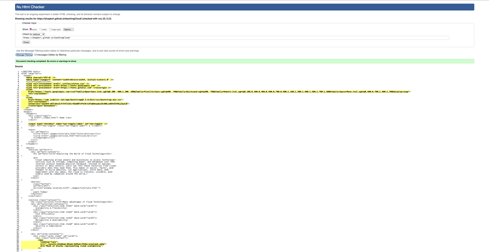

### Tutorials Page

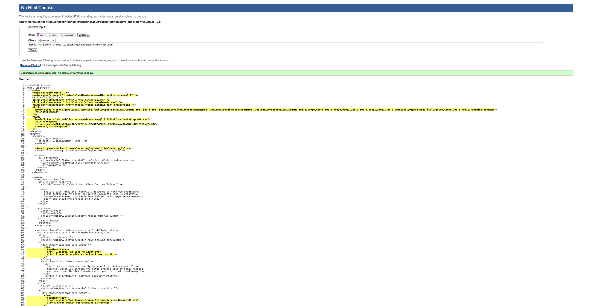

### Services Page

### Create Account Tutorial

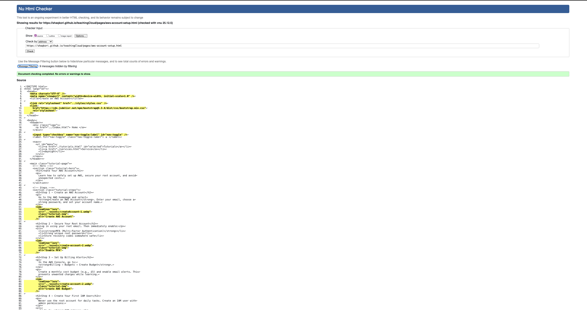

### S3 Website Tutorial

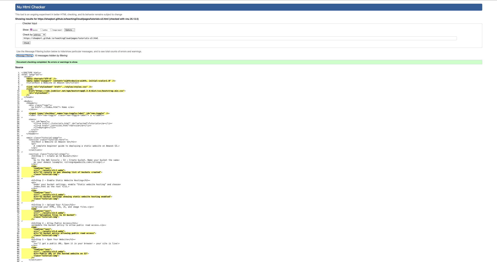

### Lambda Tutorial

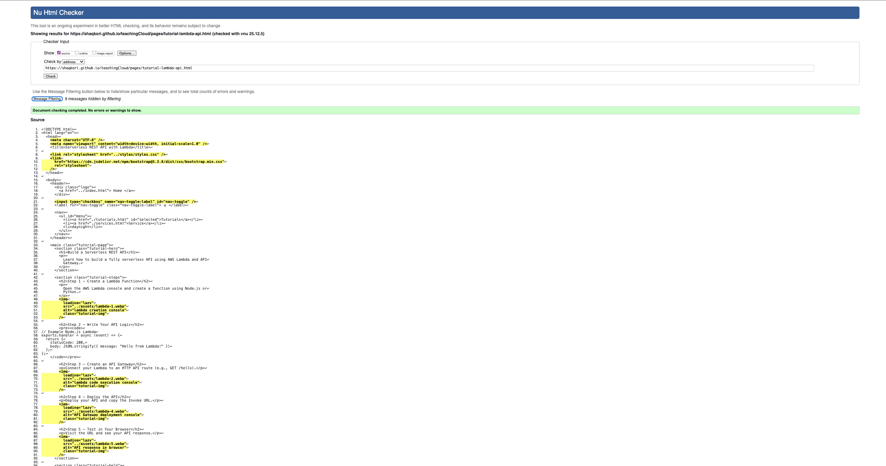

### DynamoDB Tutorial

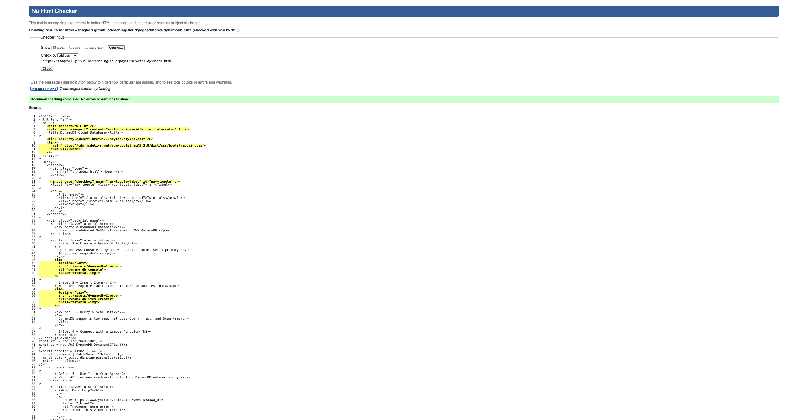

## Perforamance Testing and Accessibilty

Tested with the light house tool on chrome dev tools.

Gives u a score from 0 - 100 on the following categories:

- Accessibilty
- Performance
- SEO
- Best practices

with 0 - 49 being bad 50-89 being medium and 90 - 100 being good

### Home Performance

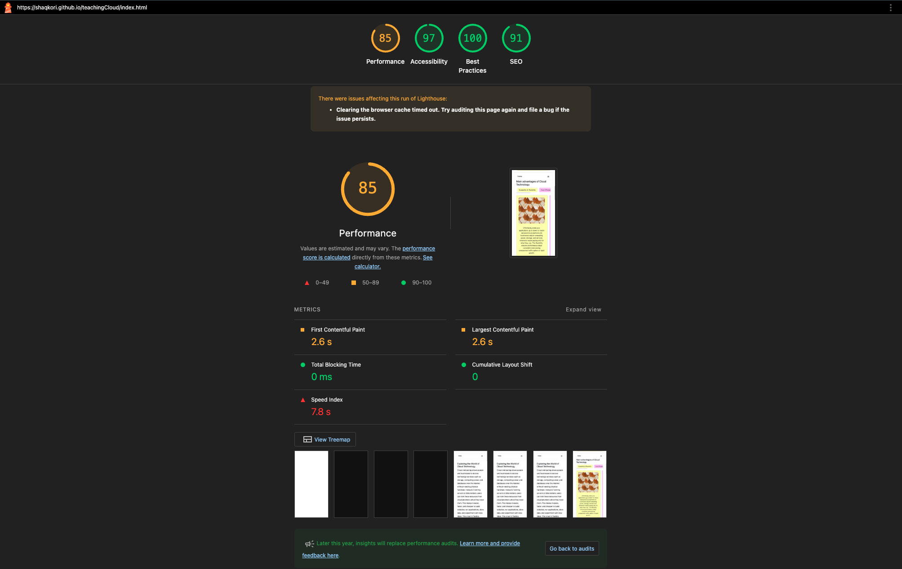

### Tutorials Performance

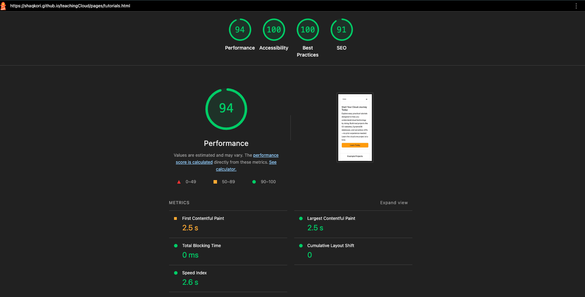

### Services Performance

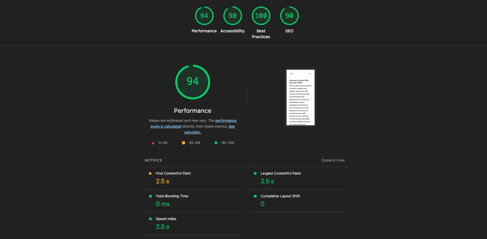

### Create Account Tutorial Performance

### S3 Tutorial Performance

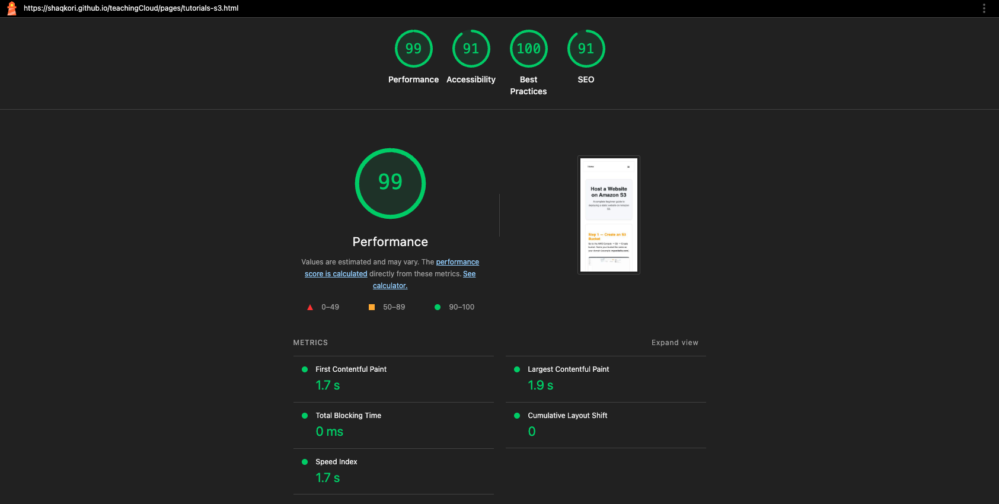

### Lambda Tutorial Performance

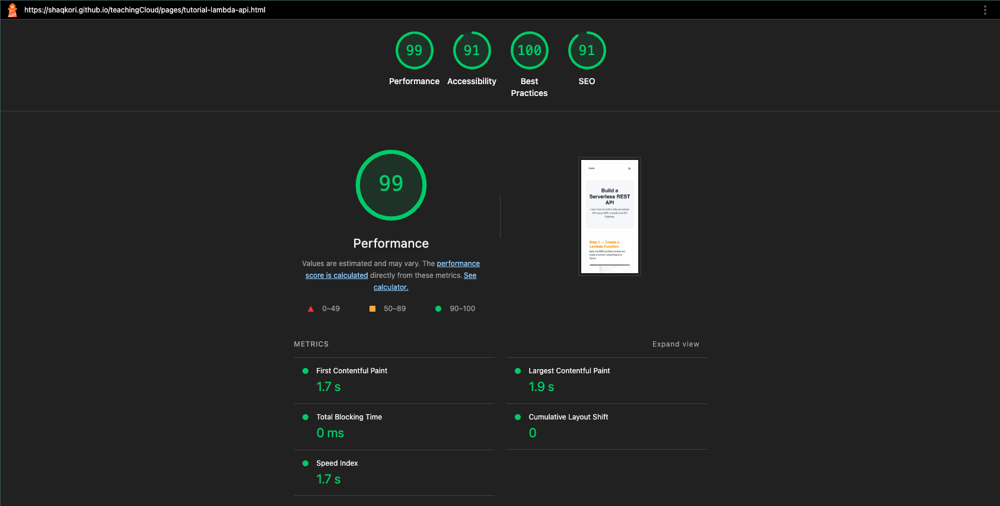

### DynamoDB Tutorial Performance

